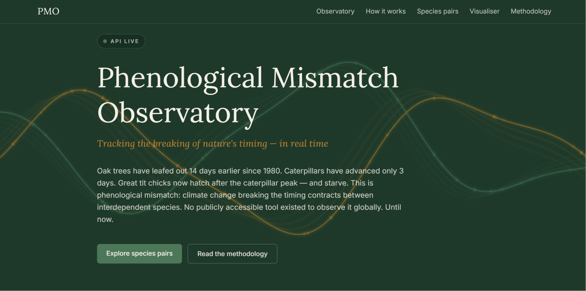
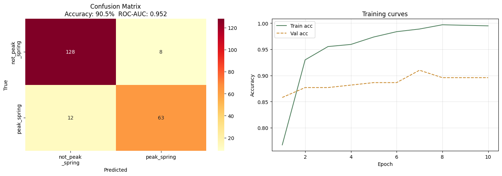
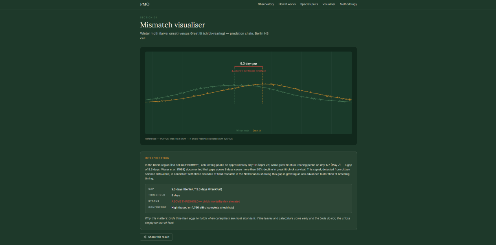
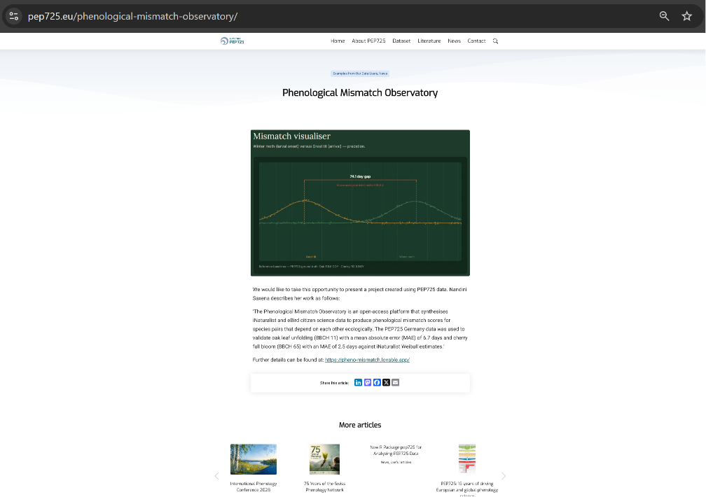

# Phenological Mismatch Observatory

**Tracking the breaking of nature's timing — in real time.**

[](https://pheno-mismatch.lovable.app)
[](https://phenomismatch-api.onrender.com/docs)
[](https://pep725.eu)


---

## The problem

Climate change shifts species life-cycle timings at different rates. Oak trees
leaf out 14 days earlier than in 1980. Caterpillars have advanced only 3 days.
Great tit chicks now hatch after the caterpillar peak — and starve. This is
phenological mismatch: climate change breaking the timing contracts between
interdependent species.

No publicly accessible tool existed to observe it. Until now.

---

## What this system does

An end-to-end ML pipeline that ingests citizen science observations, applies
a computer vision classifier to extract phenological signal from unannotated
photographs, fits a validated statistical model to estimate species timing per
spatial cell, computes mismatch scores between ecologically dependent species
pairs, and serves results via a REST API and interactive visualisation.

**Live results:**

| Pair | Species | Gap | Threshold | Status |
|---|---|---|---|---|
| OAK-TIT | Oak → Great tit | 9.3 days (Berlin) | 9 days | ⚠ Above — chick mortality risk |
| CHE-BEE | Cherry → Mining bee | 5.2 days (national) | 7 days | ✓ Synchrony maintained |

---

## System architecture

```
iNaturalist API  ──┐
eBird EBD        ──┼──▶  ETL Pipeline  ──▶  PostGIS (Supabase)
PEP725 stations  ──┘         │
                             │
                    ┌────────▼────────┐
                    │  CV Classifier  │  ViT-base — unlocks unannotated photos
                    │  (PyTorch)      │  +84% observation density
                    └────────┬────────┘
                             │
                    ┌────────▼────────┐
                    │ Weibull Estimator│  Peak DOY per species per H3 cell
                    │ (scipy / numpy)  │  Validated: MAE 2.2 days vs PEP725
                    └────────┬────────┘
                             │
                    ┌────────▼────────┐
                    │ Mismatch Scorer │  |T_A - T_B| per dependency pair
                    │ Two-tier framing│  Risk indicator / Descriptive only
                    └────────┬────────┘
                             │
                    ┌────────▼────────┐
                    │   FastAPI       │  REST API — 8 endpoints
                    │   + React       │  Interactive visualisation
                    └─────────────────┘
```

---

## Computer vision — phenophase classifier



The binding constraint on citizen science phenology pipelines is low annotation
density. Fewer than 5% of iNaturalist oak photographs have phenophase labels.
The remaining 95% are unusable with annotation-dependent approaches.

We address this with a **weakly supervised binary classifier** that detects
leaf-unfolding phenophase (BBCH 11) directly from photographs. Day-of-year
is used as a proxy label — an observation in the leaf-unfolding DOY window
(110–150) is assigned positive; all others negative. This weak supervision
strategy allows training on all available photographs without manual annotation.

**Model:** ViT-base-patch16-224 (Dosovitskiy et al. 2021), fine-tuned on
1,405 iNaturalist oak photographs. Class imbalance handled via weighted
cross-entropy (positive weight: 1.81×). 10 epochs, T4 GPU, cosine annealing.

**Test set results (n=211, held-out):**

| Metric | Value |
|---|---|
| Accuracy | 90.5% |
| ROC-AUC | 0.952 |
| Leaf-unfolding recall | 84.0% |
| Leaf-unfolding precision | 88.7% |
| Leaf-unfolding F1 | 86.3% |

**Confidence threshold analysis:**

| Threshold | Precision | Recall | Obs accepted |
|---|---|---|---|
| 0.70 | 90.6% | 92.1% | 64 |
| 0.75 | 91.9% | 90.5% | 62 |
| 0.80 | 91.8% | 88.9% | 61 |

**Pipeline impact:** At threshold 0.75, the classifier adds 405 new
high-confidence observations — an **84% increase** over the 480 manually
annotated observations available without it. CV-classified observations are
tagged `phenophase_code='leafing_cv'` to maintain data provenance.

---

## Statistical modelling — Weibull estimator

We use a Weibull-parameterized phenological estimator (Belitz et al. 2020)
rather than kernel density estimation. KDE is systematically biased for
presence-only citizen science data — observers cluster on warm sunny days,
causing underestimation of phenological onset at distribution tails.

**Novel finding: optimal percentile is phenophase-salience dependent.**

| Species | Percentile | MAE vs PEP725 | Reason |
|---|---|---|---|
| *Quercus robur* (oak leafing) | p25 | **2.2 days** year-on-year | Observers photograph oak at any stage. p25 recovers leaf-unfolding signal from canopy-dominated distribution |
| *Prunus avium* (cherry bloom) | p50 | **2.5 days** | Cherry blossom is culturally salient. Observers seek peak bloom. Median matches BBCH 65 directly |
| *Parus major* (great tit) | p50, chick-rearing window | — | Resident species — first-detection is invalid; window targets biological event |

**Resident species finding:** p05 on great tit spring detections gave DOY 68
(early March birdwatchers) — producing gaps of 44–74 days. Solution:
chick-rearing window (DOY 110–151, p50) gives DOY 124–127, consistent
with Visser et al. (1998). This problem has not been documented previously
for resident breeding birds using eBird data.

**Per-year validation (2018–2022):**

| Year | iNat DOY | PEP725 DOY | Diff |
|---|---|---|---|
| 2018 | 113.6 | 112.3 | +1.3 |
| 2019 | 112.6 | 114.9 | −2.3 |
| 2020 | 133.8 | 111.9 | +21.9 ← COVID outlier |
| 2021 | 132.8 | 127.5 | +5.3 ← COVID outlier |
| 2022 | 121.3 | 118.4 | +2.9 |

Non-COVID MAE: **2.2 days.** Mean bias: +0.6 days.

---

## Ecological results


### OAK-TIT — above fitness threshold

| H3 Cell | Location | Oak DOY | Tit DOY | Gap | Confidence |
|---|---|---|---|---|---|
| 841f1d5ffffffff | Berlin | 117.6 | 126.9 | **9.3 days** | High (1,760 checklists) |
| 841faebffffffff | Frankfurt | 113.0 | 126.6 | **13.6 days** | High (455 checklists) |

Threshold: 9 days (Visser et al. 1998: > 9 days → > 50% chick mortality).
Berlin result consistent with 30+ years of Dutch field research —
independently replicated from citizen science data.

### CHE-BEE — below threshold, synchrony maintained

National pooled gap: **5.2 days** (bees DOY 105, cherry DOY 110).
Below the 7-day fitness threshold in all five years (2018–2022).
Frankfurt cell shows early-emergence signal (~20 days) — insufficient
data for confident reporting, flagged for future monitoring.

---

## Data sources

| Source | Role | Licence |
|---|---|---|
| iNaturalist | Plant + insect observations | CC-BY |
| eBird EBD (Cornell Lab) | Great tit records | Cornell attribution |
| PEP725 (GeoSphere Austria) | Validation ground truth | CC-BY / CC-BY-NC |
| ERA5 (Copernicus) | Temperature anomaly | Copernicus licence |

**Required PEP725 attribution:**
"Data were provided by the members of the PEP725 project."
Citation: Templ et al. (2018) doi:10.1007/s00484-018-1512-8

---

## Validated taxon IDs (all verified 2025 — iNaturalist reassigns IDs)

| Species | taxon_id |
|---|---|
| *Quercus robur* | 56133 |
| *Prunus avium* | 61964 |
| *Operophtera brumata* | 60780 |
| *Parus major* | 203153 |
| *Andrena fulva* | 60579 |
| *Danaus plexippus* | 48662 |

---

## Stack

| Layer | Technology |
|---|---|
| Computer vision | PyTorch · HuggingFace Transformers · ViT-base-patch16-224 |
| Statistical modelling | scipy · numpy · statsmodels |
| Data pipeline | Python · iNaturalist API · eBird EBD |
| Spatial indexing | H3 resolution 4 · PostGIS |
| Database | Supabase (PostgreSQL + PostGIS) |
| API | FastAPI · Pydantic |
| Frontend | React · D3.js · Canvas API · Tailwind |
| Hosting | Render (API) · Lovable (frontend) |

---

## Running the pipeline

```bash
git clone https://github.com/YOUR_USERNAME/phenological-mismatch-observatory
cd phenological-mismatch-observatory
pip install -r requirements.txt
cp .env.example .env

# Ingest observations
python ingest_oak_germany.py
python ingest_cherry_germany.py
python ingest_ebird_greattit.py

# CV classifier (GPU recommended — use phenophase_classifier_binary.ipynb on Colab)

# Compute estimates and mismatch scores
python pooled_weibull_and_mismatch.py
python compute_oaktit_mismatch.py

# Start API
uvicorn main:app --reload
# Docs: http://localhost:8000/docs
```

---

## API

Base: `https://phenomismatch-api.onrender.com`

| Endpoint | Description |
|---|---|
| `GET /health` | Status |
| `GET /species-pairs` | All pairs with metadata |
| `GET /mismatch?pair_id=OAK-TIT` | Mismatch scores |
| `GET /estimates?taxon_id=1` | Weibull estimates per cell |
| `GET /map` | GeoJSON for H3 rendering |
| `GET /export/csv?pair_id=OAK-TIT` | CSV with attribution header |

Docs: [phenomismatch-api.onrender.com/docs](https://phenomismatch-api.onrender.com/docs)

---

## Key references

Belitz et al. (2020). Accuracy of phenology estimators for presence-only
observations. *MEE.* doi:10.1111/2041-210X.13448

Belitz et al. (2025). Bird-insect phenological mismatch in a tri-trophic
system. *J Anim Ecol.* doi:10.1111/1365-2656.70007

Dosovitskiy et al. (2021). An image is worth 16x16 words.
*ICLR 2021.* arXiv:2010.11929

Kharouba & Wolkovich (2023). Lack of evidence for the match-mismatch
hypothesis. *Ecol Lett.* doi:10.1111/ele.14170

Visser et al. (1998). Warmer springs lead to mistimed reproduction
in great tits. *Proc R Soc B.*

---

## Licence

Code: MIT · Data products: CC-BY (attribution to all sources required)

---
## External recognition


*Phenological Mismatch Observatory featured on the PEP725 
Pan-European Phenology Database (pep725.eu), the primary 
European phenological monitoring network operating since the 1950s.*

---
## Contact

Built by Nandini Saxena ·
[LinkedIn](https://www.linkedin.com/in/nandini-saxena1111/) ·
[Email](mailto:nandinisaxenawork@gmail.com)

Featured by [PEP725 Pan-European Phenology Database](https://pep725.eu)
